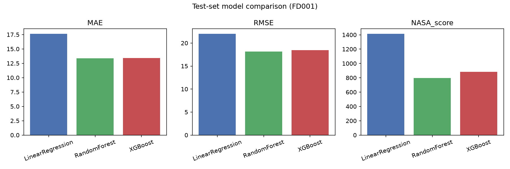
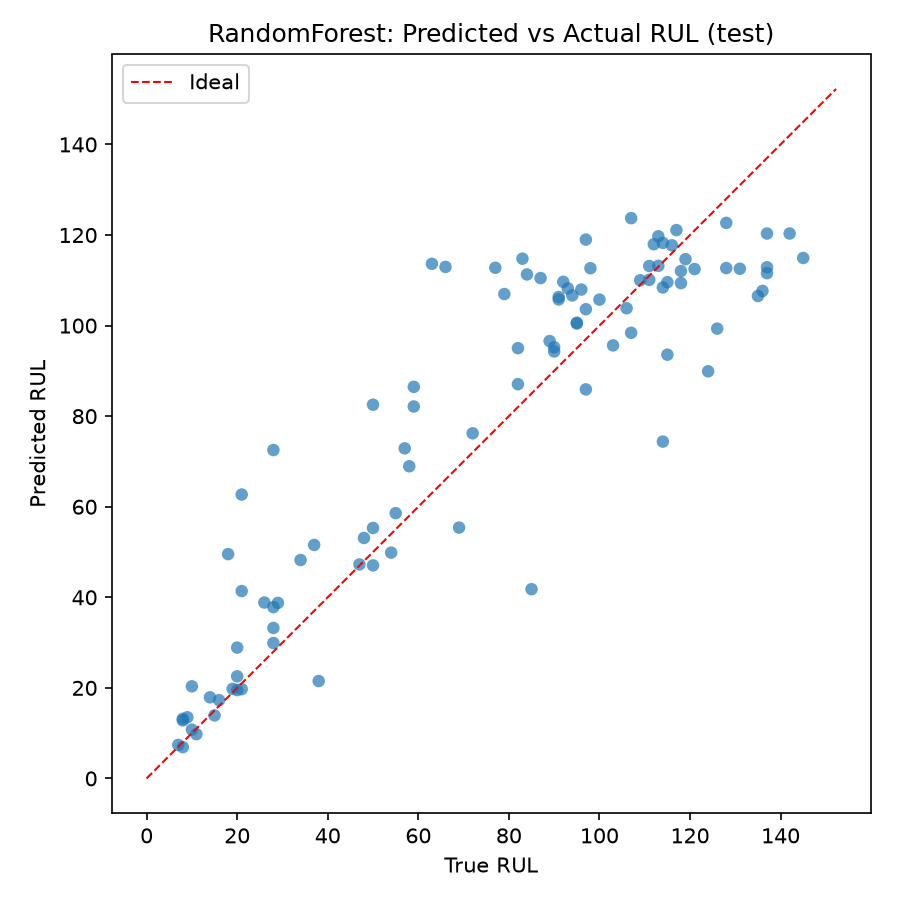

# NASA C-MAPSS Remaining Useful Life Prediction

End-to-end regression pipeline that predicts **Remaining Useful Life (RUL)** for turbofan engines using NASA’s **C-MAPSS FD001** sensor / time-series data.

This repository is organized for a clean GitHub portfolio: modular `src/`, reproducible scripts, notebooks for EDA and error analysis, and documented modeling decisions.

---

## Problem

Predict how many operational cycles remain before an engine fails.

In predictive maintenance, underestimating RUL (predicting failure too early) wastes maintenance effort, while overestimating RUL (predicting failure too late) risks unexpected downtime. This project treats RUL as a **continuous regression** target and evaluates models with both standard error metrics and NASA’s **asymmetric** scoring function, which penalizes late predictions more heavily.

Class imbalance / false-negative framing from classification problems does not apply directly here; the analogous concerns are **leakage**, **metric choice**, and **early vs late prediction cost**.

---

## Data

**Dataset:** [NASA C-MAPSS](https://data.nasa.gov/dataset/cmapss-jet-engine-simulated-data) — subset **FD001**  
(1 operating condition, 1 fault mode: HPC degradation; 100 train engines, 100 test engines)

| File | Role |
|------|------|
| `train_FD001.txt` | Run-to-failure trajectories |
| `test_FD001.txt` | Truncated trajectories (stop before failure) |
| `RUL_FD001.txt` | True RUL at each test engine’s last cycle |

Each row is one **cycle** for one **engine** (`unit_id`): 3 operating settings + 21 sensors.

Download automatically:

```bash
python scripts/download_data.py
```

Raw files are stored under `data/raw/` (gitignored).

---

## Methodology

### 1. Understand the time series
Engines are multivariate sequences. Consecutive rows from the same `unit_id` are dependent, so random row-wise splits would leak information across train/validation.

### 2. Data cleaning
- Missing values on FD001: **0**
- Dropped constant / uninformative columns: `setting_3`, `sensor_1`, `sensor_5`, `sensor_10`, `sensor_16`, `sensor_18`, `sensor_19`
- Kept 15 sensors + 2 settings as base signals

### 3. Target construction
- Uncapped RUL = `max_cycle(unit) - cycle`
- Training uses a piecewise **RUL cap of 125** (standard C-MAPSS practice) so early healthy life is not overweighted
- Official test metrics use **uncapped** ground truth from `RUL_FD001.txt`

### 4. Feature engineering
Causal rolling window (**5 cycles**) per kept signal:
- rolling mean, rolling std, rolling slope  

No future cycles enter the window. Final feature count: **68**.

### 5. Preprocessing
Linear Regression uses a `StandardScaler` inside an sklearn `Pipeline` (**fit on training engines only**). Tree models use raw engineered features.

### 6. Train / validation / test protocol
1. Split training-file engines into **80% train / 20% validation** by `unit_id` (`GroupShuffleSplit`)
2. Hyperparameter tuning for RF / XGBoost uses **GroupKFold on train engines only**
3. Official NASA test set is used **once** for final reporting (prediction on each engine’s **last cycle**)

### 7. Models
| Model | Role |
|-------|------|
| Linear Regression | Scaled baseline |
| Random Forest | Non-linear ensemble |
| XGBoost | Gradient-boosted trees |

RF and XGBoost use randomized search with group-aware CV (see `docs/DECISIONS.md`).

### 8. Metrics
- **MAE**, **RMSE**
- **NASA asymmetric score** (lower is better; late errors cost more)

Full decision rationales: [`docs/DECISIONS.md`](docs/DECISIONS.md).

---

## Results

### Validation (held-out engines from the training file)

| Model | MAE | RMSE | NASA score |
|-------|-----|------|------------|
| Linear Regression | 15.86 | 19.77 | 26387 |
| Random Forest | 11.89 | 16.33 | 28845 |
| XGBoost | **11.44** | **16.04** | 29334 |

### Official FD001 test (last cycle per engine)

| Model | MAE | RMSE | NASA score |
|-------|-----|------|------------|
| Linear Regression | 17.64 | 22.01 | 1414 |
| **Random Forest** | **13.38** | **18.13** | **797** |
| XGBoost | 13.43 | 18.46 | 881 |

**Best test RMSE / NASA score:** Random Forest.



### Error analysis (Random Forest)
- Mean signed error (pred − true): **+3.58** cycles → slight average late bias
- Late predictions: **65%**; early: **35%**
- Largest absolute errors include engines 79, 27, 18, 93, 37 (see `reports/per_engine_errors.csv`)
- Errors tend to be harder in mid/high RUL regimes where degradation signal is weaker



### Model interpretation
Tree importances highlight rolling statistics of high-signal sensors (e.g. sensors associated with HPC health trends). See:

- `reports/figures/rf_importance.png`
- `reports/figures/xgb_importance.png`
- `reports/rf_feature_importance.csv`

---

## Conclusions

1. **Engine-wise splitting and causal rolling features** are essential for an honest RUL pipeline.
2. **Non-linear models beat the linear baseline** on FD001 test MAE/RMSE/NASA score.
3. **Random Forest** edged XGBoost on the official test set in this run; both clearly outperform linear regression.
4. Reporting **MAE + RMSE + NASA score** together is more informative than a single accuracy-like number, especially for late-prediction risk.
5. Limitations: FD001 only (single condition/fault); classical ML only (no LSTM); rolling window fixed at 5.

**Natural next steps:** multi-subset FD002–FD004, sequence models, and calibrated uncertainty for maintenance thresholds.

---

## Setup

```bash
# Python 3.10–3.11 recommended (xgboost wheels)
python -m venv .venv
source .venv/bin/activate   # Windows: .venv\Scripts\activate
pip install -r requirements.txt
```

### Reproduce results

```bash
python scripts/download_data.py
python scripts/train_eval.py
```

Outputs:
- `reports/metrics.json`
- `reports/figures/`
- `reports/per_engine_errors.csv`

### Notebooks
- `notebooks/01_eda.ipynb` — sensor/time-series understanding, cleaning, EDA
- `notebooks/02_modeling_error_analysis.ipynb` — comparison, errors, interpretation

---

## Project structure

```
├── README.md
├── docs/DECISIONS.md
├── requirements.txt
├── data/raw/                 # downloaded FD001 (gitignored)
├── notebooks/
├── src/cmapss/               # reusable pipeline package
├── scripts/download_data.py
├── scripts/train_eval.py
└── reports/                  # metrics, figures, error tables
```

## License / attribution

C-MAPSS data © NASA / PCoE. This project is an independent educational ML pipeline built on the public dataset.
